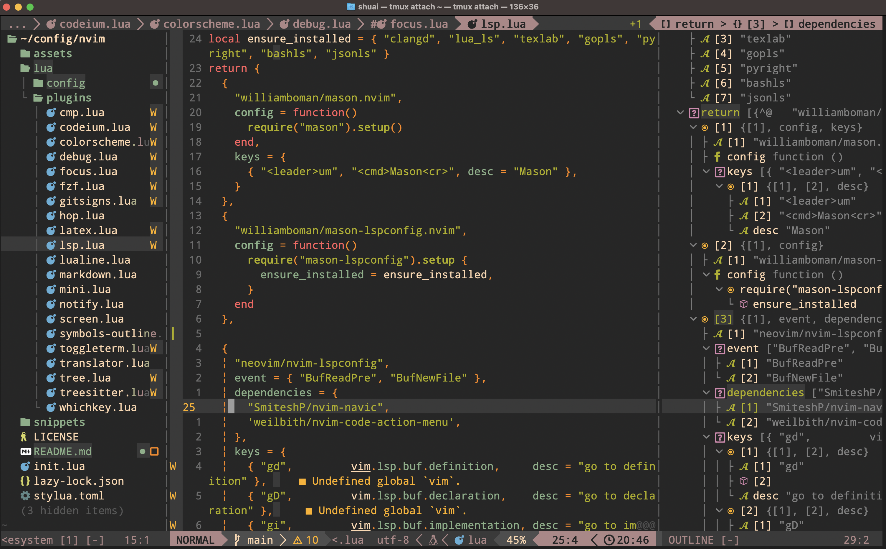
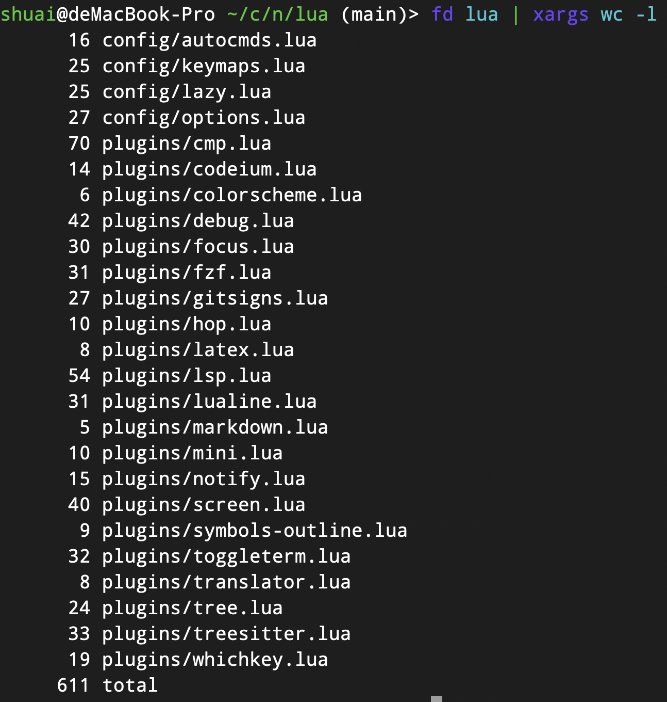

其中左侧目录是相关的插件集合，每一个插件分别对应相关的文件。

如果你想重新配置一个适合自己的插件，参考我的比较适合，因为我的相对于比现有的开箱即用的一些更为简单且容易理解，如果你想要继续扩展需要参考其余的开箱即用的例如LazyVim的插件。

lua文件中仅有600多行的代码，实现的效果对于我来说甚至比5000多行LazyVim更加完善。

# 参考项目

## 💤 LazyVim

A starter template for [LazyVim](https://github.com/LazyVim/LazyVim).
Refer to the [documentation](https://lazyvim.github.io/installation) to get started.
